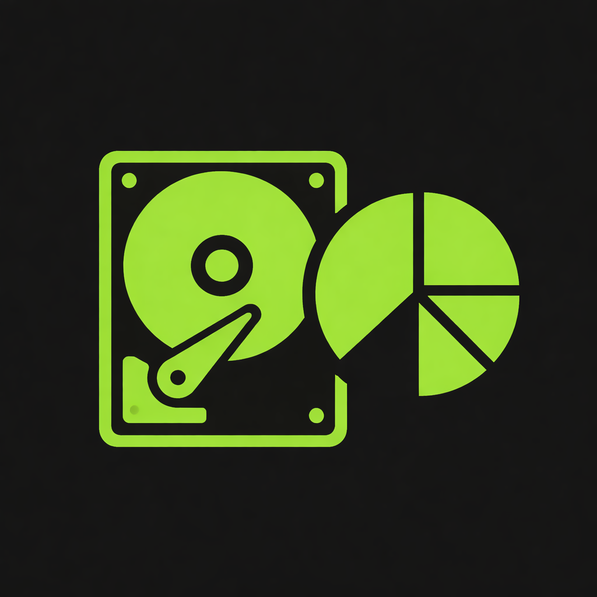
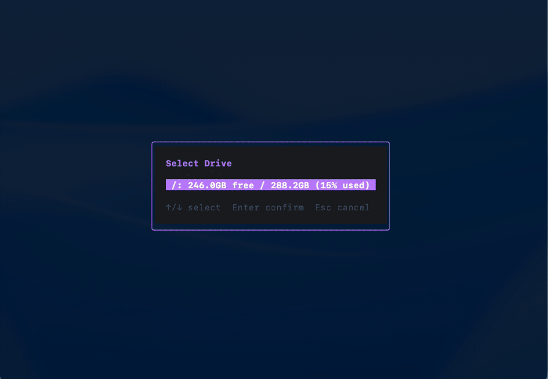

<p align="center">
  
</p>

<h1 align="center">DiskDive</h1>

<p align="center">
  <strong>See where your disk space went — and take it back.</strong><br>
  A fast, terminal-based disk space analyzer with treemap visualization.
</p>

<p align="center">
  <a href="https://github.com/lumipallolabs/diskdive/releases/latest"></a>
  <a href="LICENSE"></a>
  
</p>

<p align="center">
  
</p>

---

## Why DiskDive?

- **Blazing fast** — Parallel scanning makes short work of even the largest drives
- **Treemap visualization** — Instantly spot the biggest space hogs with proportional blocks
- **Real-time deletion tracking** — Delete files and watch your freed space update live
- **Cross-platform** — Native support for macOS, Windows, and Linux
- **Keyboard-driven** — Vim-style navigation for power users (`hjkl`, `/`, `g/G`)
- **Zero config** — Just run it. No setup, no dependencies, no fuss

## Installation

### macOS — Download the App

The easiest way to get started. Universal binary (Intel + Apple Silicon).

**[Download DiskDive.dmg](https://github.com/lumipallolabs/diskdive/releases/latest)** — Open the DMG, drag to Applications, done.

### All Platforms — Install with Go

Requires Go 1.21+:

```bash
go install github.com/lumipallolabs/diskdive@latest
```

### Build from Source

```bash
git clone https://github.com/lumipallolabs/diskdive.git
cd diskdive
go build .
```

## Quick Start

```bash
# Launch with interactive drive selector
diskdive

# Scan a specific directory
diskdive /path/to/directory
```

On **macOS**, you can also double-click `DiskDive.app` from Finder — it opens in Terminal automatically.

> **Tip:** Create a symlink for quick terminal access:
> ```bash
> ln -s /Applications/DiskDive.app/Contents/MacOS/diskdive /usr/local/bin/diskdive
> ```

<details>
<summary><strong>Keyboard Controls</strong></summary>

### Navigation
| Key | Action |
|-----|--------|
| `↑↓←→` or `hjkl` | Navigate |
| `PgUp/PgDn` | Scroll faster |
| `g/G` | Jump to top/bottom |
| `Tab` | Switch between tree and treemap panels |

### Actions
| Key | Action |
|-----|--------|
| `Enter` | Expand/zoom into directory |
| `Esc` or `Backspace` | Go back / collapse |
| `Space` | Preview file (Quick Look on macOS) |
| `e` | Select different drive |
| `o` | Open in file manager |
| `r` | Rescan current drive |

### Other
| Key | Action |
|-----|--------|
| `?` | Show help |
| `q` | Quit |

</details>

## Requirements

- macOS 12+ / Windows 10+ / Linux

## Contributing

Contributions are welcome! See [DEVELOPMENT.md](DEVELOPMENT.md) for build instructions and architecture overview.

## License

Apache License 2.0 — See [LICENSE](LICENSE) for details.
